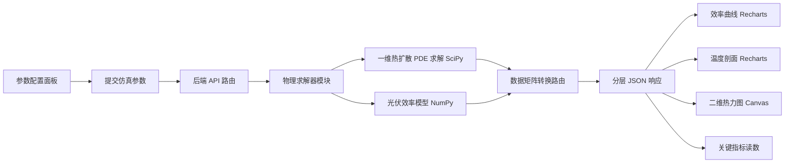

## 1. 产品概述

太阳能光伏阵列发电效率模拟与热扩散估计系统，面向新能源实验室研究人员。系统通过一维热扩散偏微分方程数值求解，结合光伏电池温度-辐照-效率物理模型，在不同环境温度与光照条件下对光伏阵列的发电效率进行动态仿真，并实时可视化温度场分布与效率曲线。

- 主要用途：为新能源实验室提供光伏阵列在不同温度/光照工况下的发电效率仿真与热扩散分析工具，支撑材料选型、阵列布局与热管理研究。
- 目标用户：新能源/光伏领域科研人员、研究生。
- 市场价值：替代商用仿真软件的轻量化开源方案，可二次开发集成至实验室数据管线。

## 2. 核心功能

### 2.1 用户角色
| 角色 | 使用方式 | 核心权限 |
|------|----------|----------|
| 研究人员 | 直接访问 Web 界面 | 配置仿真参数、运行求解、查看与导出结果 |

### 2.2 功能模块
1. **仿真驾驶舱（主页面）**：参数配置面板、效率曲线图表、一维温度场剖面、二维热力分布图谱、关键指标读数。
2. **仿真结果分析页**：多工况对比、时间演化动画、数据矩阵导出。

### 2.3 页面详情
| 页面名称 | 模块名称 | 功能描述 |
|-----------|----------|----------|
| 仿真驾驶舱 | 参数配置面板 | 配置环境温度、光照辐照度、阵列长度、网格节点数、时间步长、总仿真时长、热扩散系数、电池参考效率、温度系数等参数；一键运行求解 |
| 仿真驾驶舱 | 关键指标读数 | 实时显示峰值效率、平均电池温度、峰值温度、总发电量（归一化）、热扩散稳态时间 |
| 仿真驾驶舱 | 效率曲线图表 | Recharts 折线图展示沿阵列长度方向的发电效率分布；辐照度-效率响应曲线 |
| 仿真驾驶舱 | 一维温度剖面 | Recharts 面积图展示当前时刻沿阵列长度方向的温度分布曲线，支持时间帧拖动 |
| 仿真驾驶舱 | 二维热力分布图谱 | 时间-空间二维热力图（Canvas 渲染），横轴为阵列位置，纵轴为时间演化，颜色映射温度 |
| 仿真驾驶舱 | 时间演化动画 | 播放/暂停按钮，逐帧展示温度场随时间变化 |
| 结果分析页 | 多工况对比 | 选择多组参数配置，叠加显示效率与温度曲线对比 |

## 3. 核心流程

用户在驾驶舱配置仿真参数 → 前端将参数封装为 JSON 提交后端 → 后端物理求解器模块运行一维热扩散 PDE 数值求解（SciPy）与光伏效率模型（NumPy）→ 数据矩阵转换路由模块将解矩阵转换为前端可消费的分层 JSON → 前端 Recharts 渲染效率曲线与温度剖面，Canvas 渲染二维热力图 → 用户可导出数据矩阵。

## 4. 用户界面设计

### 4.1 设计风格
- **设计方向**：科学仪表盘 / 任务控制台美学（Mission Control）。深空背景配以数据可视化荧光色，体现精密科研仪器的质感。
- **主色调**：深空蓝黑 `#070B14` 背景，青蓝 `#22D3EE` 为主数据色，琥珀橙 `#F59E0B` 为热力/太阳能暖色指示，翡翠绿 `#34D399` 为效率正向指标。
- **次色调**：钢灰 `#1E293B` 面板，`#334155` 边框分隔。
- **按钮风格**：扁平矩形带荧光描边，运行按钮为青蓝发光，次级按钮为透明描边。
- **字体**：标题/数据使用 JetBrains Mono（等宽，体现数据精确感），正文 UI 使用 Space Grotesk 的替代——选用 Sora（几何感强、科技感）。
- **布局风格**：12 栅格仪表盘布局，左侧参数面板（3 栏宽），右侧主可视化区（9 栏宽）分上下两区。
- **图标/风格**：线性科学图标，数据点带辉光，背景叠加细密栅格与扫描线纹理。

### 4.2 页面设计概览
| 页面名称 | 模块名称 | UI 元素 |
|-----------|----------|---------|
| 仿真驾驶舱 | 顶部标题栏 | 项目名 + 状态指示灯（待机/计算中/完成），等宽字体 |
| 仿真驾驶舱 | 左侧参数面板 | 分组手风琴（环境参数/材料参数/数值参数），滑块+数值输入双控，运行按钮发光 |
| 仿真驾驶舱 | 右上指标卡 | 4 个发光数字读数卡片，等宽大字号，单位标注 |
| 仿真驾驶舱 | 右上效率曲线 | Recharts 折线图，青蓝线，半透明填充，悬停十字准星 |
| 仿真驾驶舱 | 右下二维热力图 | Canvas 渲染，琥珀-青蓝双色渐变 colormap，时间轴滑块 |
| 仿真驾驶舱 | 右下温度剖面 | Recharts 面积图叠加在热力图侧栏 |

### 4.3 响应式
桌面优先（科研工作站场景），最小宽度 1280px；在窄屏下参数面板折叠为顶部抽屉，可视化区垂直堆叠。触控优化滑块与时间轴拖动。

### 4.4 动效
- 加载/计算时：状态灯呼吸动画，热力图扫描线效果。
- 数据更新：折线图路径绘制动画，数字读数滚动计数。
- 时间演化：热力图逐帧淡入，温度剖面随时间轴同步移动。
