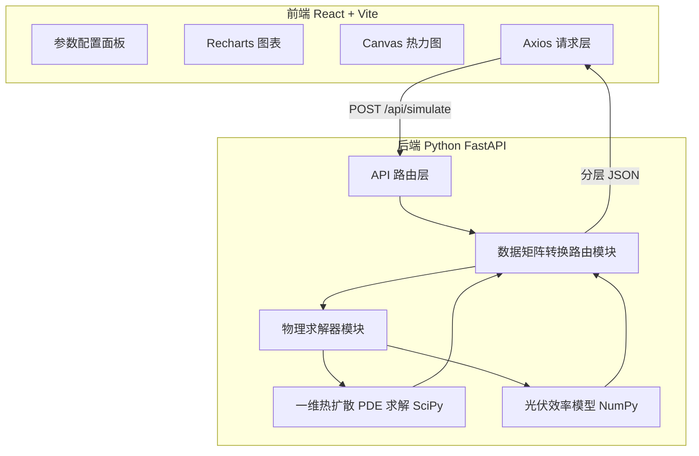
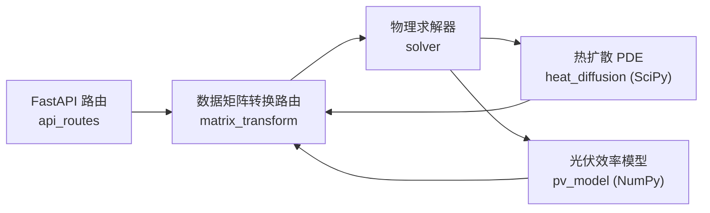
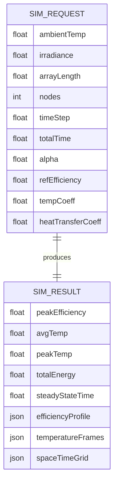

## 1. 架构设计



系统分为前后端两层。前端为纯静态 React SPA，负责参数配置与可视化渲染；后端为 Python FastAPI 服务，承载核心科学计算。前后端通过 REST/JSON 通信，后端内部遵循"路由层 → 矩阵转换 → 物理求解"三段式数据流。

## 2. 技术说明

- **前端**：React@18 + Vite@5 + Recharts@2 + TailwindCSS@3
- **初始化工具**：vite（`npm create vite@latest`）
- **后端**：Python 3.11 + FastAPI + Uvicorn
- **科学计算**：NumPy（数组与效率模型）+ SciPy（`scipy.integrate.solve_ivp` 一维热扩散 PDE 时间推进 / `scipy.sparse` 稀疏有限差分）
- **跨域**：FastAPI CORS 中间件允许前端源
- **数据库**：无，纯计算型服务，结果在内存中生成后直接返回；可选导出 CSV
- **图表渲染**：Recharts 处理 1D 曲线/面积图；二维热力分布使用原生 Canvas 自绘以获得高性能逐帧渲染

## 3. 路由定义（前端）
| 路由 | 用途 |
|-------|------|
| `/` | 仿真驾驶舱主页（参数配置 + 可视化） |
| `/analysis` | 多工况结果对比分析页 |

## 4. API 定义（后端）

### 4.1 请求 `POST /api/simulate`
```typescript
interface SimulateRequest {
  ambientTemp: number;      // 环境温度 ℃
  irradiance: number;       // 光照辐照度 W/m²
  arrayLength: number;      // 阵列长度 m
  nodes: number;            // 空间网格节点数
  timeStep: number;         // 时间步长 s
  totalTime: number;        // 总仿真时长 s
  alpha: number;            // 热扩散系数 m²/s
  refEfficiency: number;    // 参考效率 0-1
  tempCoeff: number;        // 温度系数 /℃
  heatTransferCoeff: number;// 对流换热系数 W/(m²·K)
}
```

### 4.2 响应 `200 OK`
```typescript
interface SimulateResponse {
  metrics: {
    peakEfficiency: number;
    avgTemp: number;
    peakTemp: number;
    totalEnergy: number;
    steadyStateTime: number;
  };
  // 沿阵列长度方向的稳态效率分布
  efficiencyProfile: { x: number; eff: number }[];
  // 沿阵列长度方向的温度剖面（按时帧）
  temperatureFrames: number[][];   // [timeIndex][spaceIndex]
  // 用于二维热力图的空间-时间矩阵
  spaceTimeGrid: {
    space: number[];     // 空间坐标
    time: number[];      // 时间坐标
    matrix: number[][];  // [timeIndex][spaceIndex] 温度
  };
  timeLabels: number[];
}
```

### 4.3 请求 `GET /api/health`
健康检查，返回 `{ status: "ok" }`。

## 5. 服务器架构图（后端）



后端模块分层：
- **路由层 `router/api_routes.py`**：接收 HTTP 请求，参数校验（Pydantic），调度求解与转换。
- **数据矩阵转换路由 `router/matrix_transform.py`**：将 NumPy 解矩阵裁剪/降采样/分层打包为前端友好的 JSON 结构，计算关键指标。
- **物理求解器 `physics/solver.py`**：编排热扩散与效率模型的耦合求解。
- **热扩散 PDE `physics/heat_diffusion.py`**：一维热扩散方程 `∂T/∂t = α∂²T/∂x² + Q` 的有限差分离散，SciPy `solve_ivp` 时间推进。
- **光伏效率模型 `physics/pv_model.py`**：基于温度与辐照度的效率模型 `η = η_ref·(1 - β(T_cell - T_ref))`，热源由辐照度产生。

## 6. 数据模型

### 6.1 数据模型定义



### 6.2 数据定义语言
本项目无持久化数据库，数据流为请求-响应型内存计算。物理模型核心公式：

**一维热扩散方程（有限差分离散）：**
```
∂T/∂t = α · ∂²T/∂x² + Q(x,t)
```
空间中心差分 + 时间显式/隐式推进，边界条件采用对流换热（牛顿冷却）：
```
- k·∂T/∂x |_{boundary} = h·(T_surf - T_amb)
```

**光伏效率模型：**
```
T_cell = T_solved(x,t)
η(x,t) = η_ref · (1 - β_ref · (T_cell - T_ref)) · (G / G_ref)
Q(x) = G · (1 - η)   // 未转化为电能的辐照成为热源
```

**数值稳定性：** 显式格式需满足 `α·Δt/Δx² ≤ 0.5`，后端自动校验并在必要时切换隐式求解器。
